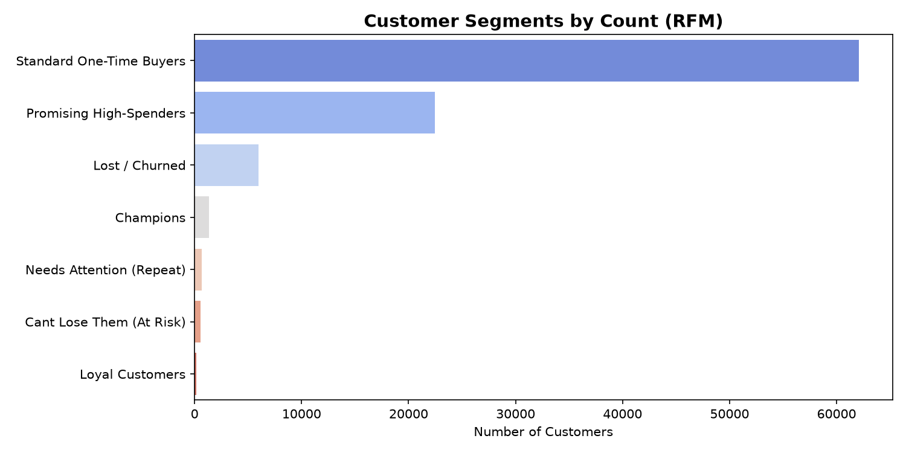
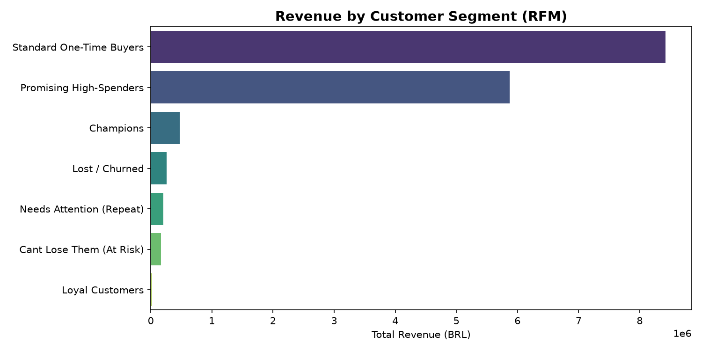
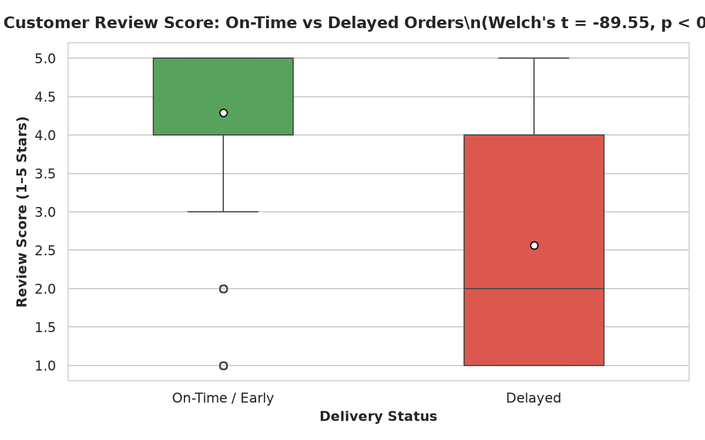
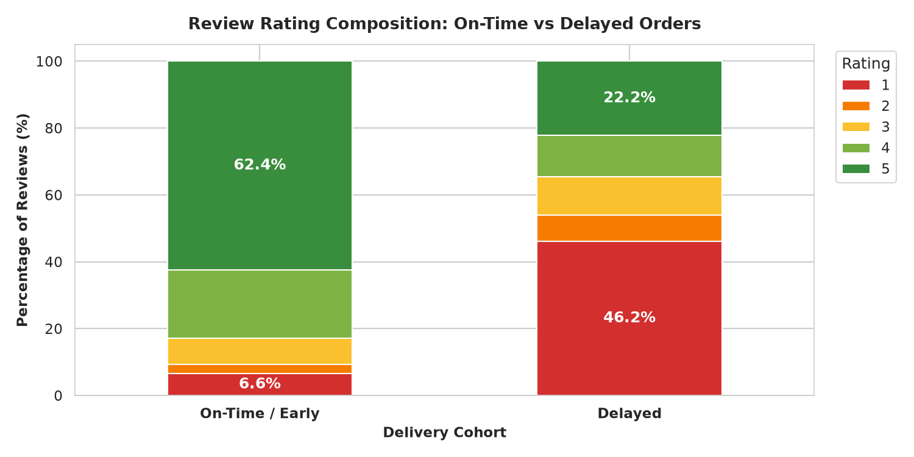
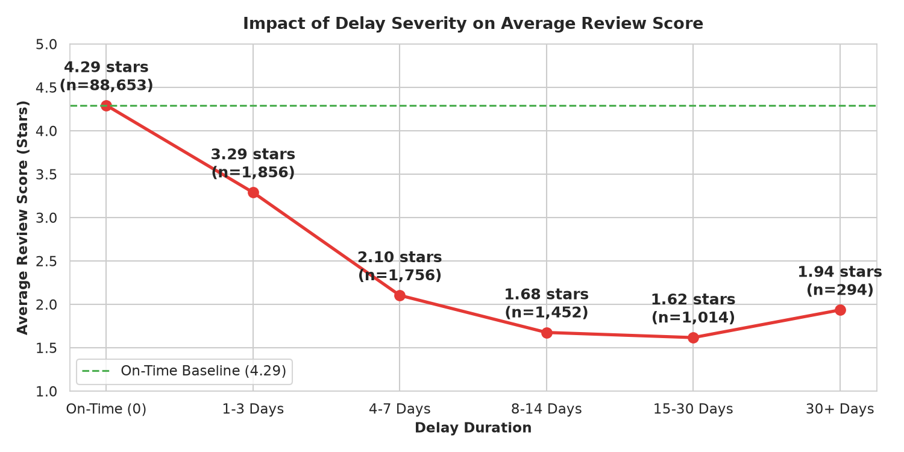

# Olist E-Commerce Sales Analysis

An end-to-end data analytics portfolio project built on the Brazilian Olist marketplace dataset (~100,000 real orders, 2016–2018). The project covers the full analytics stack: relational database design and ETL in MySQL, exploratory data analysis and statistical testing in Python, customer segmentation via RFM analysis, and an interactive three-page business intelligence dashboard in Power BI.

---

## Tech Stack

| Layer | Tools |
|---|---|
| Database | MySQL 8.0 |
| Data Analysis | Python 3.11, Pandas, NumPy, SciPy, Matplotlib, Seaborn |
| Business Intelligence | Power BI Desktop, DAX |
| Reporting | Excel (Executive Summary Workbook) |
| Version Control | Git, GitHub |

---

## Project Structure

```
ecommerce-sales-analysis/
|
|- Data/
|   |- raw_data/                  # 9 original Olist CSV files (unchanged)
|   `- analysed_data/
|       |- rfm_output.csv         # Full RFM scored customer table (~93k rows)
|       `- rfm_segment_summary.csv
|
|- Sql/
|   |- 01_schema_setup.sql        # DDL: database + 8 normalized tables
|   |- 02_data_import.sql         # LOAD DATA INFILE for all 9 CSVs
|   |- 03_data_quality.sql        # Null checks, duplicate detection, date validation
|   |- 04_eda_kpis_logistics.sql  # KPI views: revenue, payments, categories, delivery
|   |- 05_advanced_cohort_rfm.sql # RFM scoring, cohort retention, Pareto seller analysis
|   |- 06_production_views.sql    # Master analytical views consumed by Power BI
|   `- CSV output/                # Exported query results used in Excel workbook
|
|- Python/
|   |- 01_data_cleaning_eda.ipynb          # EDA, data quality, distribution analysis
|   |- 02_rfm_customer_segments.ipynb      # RFM model, scoring, segmentation
|   |- 03_hypothesis_testing.ipynb         # Statistical tests: t-test, Mann-Whitney, Chi-square
|   `- PNG/                                # All exported chart images
|
|- Power BI/
|   |- 01_olist_sales_dashboard.pbix       # Page 1: Sales Executive Overview
|   |- 02_olist_sales_dashboard.pbix       # Page 2: Customer and Geography
|   |- 03_olist_sales_dashboard.pbix       # Page 3: Logistics and Satisfaction
|   `- Screenshots/                        # Dashboard preview images
|
|- Excel/
|   `- olist_executive_summary.xlsx        # Standalone 4-sheet executive summary
|
`- Docs/
    `- excel_executive_summary_roadmap.md
```

---

## Dataset

**Source**: [Olist E-Commerce Public Dataset](https://www.kaggle.com/datasets/olistbr/brazilian-ecommerce) — Kaggle  
**Scope**: 99,441 orders across 27 Brazilian states, September 2016 to October 2018  
**Tables**: customers, orders, order_items, order_payments, order_reviews, products, sellers, geolocation, product_category_name_translation

---

## Part 1: SQL — Database Design and Analysis

**Scripts**: `Sql/01` through `Sql/06`

### What was built

- Normalized relational schema with 8 tables, primary and foreign keys, appropriate indexes
- Bulk data import pipeline using `LOAD DATA INFILE` with charset and date format handling
- Data quality audit: null rate per column, duplicate order detection, date consistency checks
- 15+ production-grade analytical views covering revenue KPIs, logistics metrics, and cohort data

### Key SQL Views

| View | Purpose |
|---|---|
| `vw_business_summary` | Top-line KPIs: GMV, AOV, unique buyers, active sellers |
| `vw_monthly_revenue_growth` | Month-on-month revenue with LAG-based growth % |
| `vw_category_revenue` | Revenue and ratings by product category |
| `vw_delivery_by_state` | Avg delivery days and delay rate per state |
| `vw_delay_review_impact` | Mean review scores split by delivery performance |
| `vw_rfm_top100` | Top 100 customers scored by Recency, Frequency, Monetary |
| `vw_seller_pareto` | Pareto (80/20) distribution across the seller base |
| `vw_cohort_retention` | Monthly cohort retention matrix |

---

## Part 2: Python — EDA, RFM Segmentation, Hypothesis Testing

### Notebook 1: Data Cleaning and EDA (`01_data_cleaning_eda.ipynb`)

- Assessed null rates and data completeness across all 9 tables
- Analyzed order volume trends, delivery lead time distributions, and peak ordering hours
- Identified that 96% of orders were delivered, with a median delivery time of 12 days

**Key charts produced:**

| Chart | Insight |
|---|---|
| `monthly_orders.png` | Strong upward growth trend from Q1 2017 through mid-2018 |
| `top_categories.png` | Health & Beauty and Watches lead in revenue |
| `delivery_distribution.png` | Delivery times range from 1 to 60+ days |
| `heatmap_orders.png` | Peak ordering: weekday afternoons, Sunday evenings |

---

### Notebook 2: RFM Customer Segmentation (`02_rfm_customer_segments.ipynb`)

RFM (Recency, Frequency, Monetary) scoring was applied to 93,357 unique customers. Frequency was scored binary (1 vs 4) due to 97% of customers placing only one order.

**Segment Results:**

| Segment | Customers | % of Base | Avg Spend (R$) | Total Revenue (R$) | Revenue % |
|---|---|---|---|---|---|
| Standard One-Time Buyers | 62,114 | 66.53% | 135.65 | 8,425,603 | 54.63% |
| Promising High-Spenders | 22,475 | 24.07% | 261.26 | 5,871,819 | 38.07% |
| Champions | 1,373 | 1.47% | 343.67 | 471,860 | 3.06% |
| Lost / Churned | 5,967 | 6.39% | 43.69 | 260,682 | 1.69% |
| Needs Attention (Repeat) | 676 | 0.72% | 309.10 | 208,954 | 1.35% |
| Cant Lose Them (At Risk) | 582 | 0.62% | 291.37 | 169,578 | 1.10% |
| Loyal Customers | 170 | 0.18% | 82.15 | 13,965 | 0.09% |

**Key finding**: The top 25.5% of customers (Champions + Promising High-Spenders) generate 41.1% of total revenue. The 97% single-order rate represents a significant retention gap and a revenue growth opportunity.




---

### Notebook 3: Hypothesis Testing (`03_hypothesis_testing.ipynb`)

**Business Question**: Does a delayed delivery statistically and practically lower the customer review score?

**Hypotheses:**
- H0: Delivery delay has no effect on review scores
- H1: Delayed deliveries result in significantly lower review scores
- Significance level: alpha = 0.05

**Dataset**: 96,353 delivered orders with review scores

| Cohort | N | Mean Score | Median | 1-Star % | 5-Star % |
|---|---|---|---|---|---|
| On-Time / Early | 88,653 | 4.294 | 5.0 | 6.60% | 62.43% |
| Delayed | 7,700 | 2.566 | 2.0 | 46.16% | 22.22% |

**Statistical Test Results:**

| Test | Statistic | P-Value | Result |
|---|---|---|---|
| Welch's Two-Sample T-Test | t = -89.55 | p < 0.001 | Reject H0 |
| Mann-Whitney U Test | U = 152,419,611 | p < 0.001 | Reject H0 |
| Chi-Square Test | chi-sq = 14,252.21 (df=4) | p < 0.001 | Reject H0 |
| Cohen's d (Effect Size) | d = -1.44 | — | Extremely Large |

**Conclusion**: All three independent tests reject the null hypothesis. Delayed deliveries lower mean review scores by 1.73 stars (4.294 to 2.566). Cohen's d of -1.44 indicates this is not merely statistically significant but practically impactful at scale. Delayed orders are 7x more likely to receive a 1-star review.





---

## Part 3: Power BI Dashboards

Three separate Power BI files, each covering a distinct analytical theme. Data was connected directly from MySQL views and the Python-exported RFM CSV.

### Dashboard 1: Sales Executive Overview

Key KPIs, monthly revenue trend, top product categories by revenue, and payment method breakdown.


---

### Dashboard 2: Customer and Geography

Brazil state-level revenue map, RFM segment distribution, freight vs delivery scatter, and repeat customer rate analysis.


---

### Dashboard 3: Logistics and Satisfaction

Delivery delay rate by state, average delivery days KPIs, 1-star review rate, and the delay-vs-review-score dual-axis trend.


---

## Key Business Insights

### Revenue and Growth
- Total gross revenue (2016–2018): R$ 16,009,872 across all payment types
- Monthly revenue grew from R$ 127K in January 2017 to R$ 1.13M by April 2018 — an approximate 8x increase over 15 months
- November 2017 was the single largest revenue month (R$ 1.15M), driven by a seasonal demand spike
- Average Order Value: R$ 137.75 | Average items per order: 1.13

### Customer Behavior
- 93,357 unique customers analyzed via RFM model
- 97% of customers placed exactly one order — retention is the platform's most significant growth lever
- Repeat customer rate: approximately 3%
- Top 25% of customers generate over 41% of total revenue

### Product Categories
- Top 5 by revenue: Health and Beauty (R$1.23M), Watches and Gifts (R$1.17M), Bed Bath and Table (R$1.02M), Sports and Leisure (R$0.95M), Computers and Accessories (R$0.89M)

### Payments
- Credit card dominates at 73.9% of transactions and 78.3% of payment value
- Average credit card ticket: R$ 163.32 vs Boleto R$ 145.03
- Average installment plan: 3.5 payments per credit card order

### Logistics
- 8% of delivered orders (7,700 of 96,353) were delayed beyond the estimated delivery date
- Highest delay rates: Alagoas (23.9%), Maranhao (19.7%), Piaui (16.0%), Ceara (15.3%)
- Northern and northeastern states average 19–25 delivery days vs 8–12 days for Sao Paulo
- Each additional day of delay correlates with a measurable drop in review score

### Statistical Finding
- Delayed deliveries lower average review scores by 1.73 stars (from 4.29 to 2.57)
- Delayed orders account for 46% 1-star reviews vs 6.6% for on-time orders
- Effect confirmed by three independent statistical tests (p < 0.001, Cohen's d = 1.44)

---

## Recommendations

1. **Loyalty and Retention Program**: With 97% of customers buying only once, converting even 5% of "Promising High-Spenders" to repeat buyers would represent a significant revenue uplift. Implement post-purchase follow-up campaigns and first-rebuy incentives targeting this segment.

2. **Regional Logistics SLA Reform**: Negotiate fulfillment or last-mile partnerships in Alagoas, Maranhao, Piaui, and Ceara where delay rates exceed 15%. Opening a northeastern distribution node could reduce delivery times by an estimated 5–8 days for this region.

3. **Proactive Delay Communication**: Given that delayed orders are 7x more likely to result in a 1-star review, implement automated SMS or email notifications when an order is flagged as at-risk of missing the estimated delivery date. Managing expectations reduces negative reviews even when delivery is late.

4. **Seller Quality Control**: The Pareto analysis shows that a small fraction of sellers generate the majority of GMV. Introduce a tiered seller rating system to surface underperforming sellers (low review scores + high delay rates) before they damage customer lifetime value.

---

## How to Reproduce

### Database Setup (MySQL 8.0+)

```sql
-- 1. Create the schema and tables
SOURCE Sql/01_schema_setup.sql;

-- 2. Update file paths in 02_data_import.sql to match your local Data/raw_data/ directory
SOURCE Sql/02_data_import.sql;

-- 3. Run quality checks
SOURCE Sql/03_data_quality.sql;

-- 4. Build analytical views and KPI queries
SOURCE Sql/04_eda_kpis_logistics.sql;
SOURCE Sql/05_advanced_cohort_rfm.sql;
SOURCE Sql/06_production_views.sql;
```

### Python Environment

```bash
# Create and activate virtual environment
python -m venv .venv
.venv\Scripts\activate      # Windows
source .venv/bin/activate   # macOS / Linux

# Install dependencies
pip install pandas numpy scipy matplotlib seaborn jupyter

# Launch Jupyter
jupyter notebook
```

Run notebooks in order: `01_data_cleaning_eda.ipynb` > `02_rfm_customer_segments.ipynb` > `03_hypothesis_testing.ipynb`

### Power BI

1. Open any of the three `.pbix` files in Power BI Desktop
2. Go to **Home > Transform Data > Data Source Settings**
3. Update the MySQL server connection to `localhost` and database to `olist`
4. Alternatively, import the pre-exported CSVs from `Sql/CSV output/` and `Data/analysed_data/` if MySQL is not available locally

---

## Repository Status

| Component | Status |
|---|---|
| SQL Schema and ETL | Complete |
| SQL Analytical Views | Complete |
| Python EDA | Complete |
| Python RFM Segmentation | Complete |
| Python Hypothesis Testing | Complete |
| Power BI Dashboards (3 files) | Complete |
| Excel Executive Summary | Complete |
| README | Complete |

---

## Dataset License

The Olist dataset is published under [CC BY-NC-SA 4.0](https://creativecommons.org/licenses/by-nc-sa/4.0/). This project is for educational and portfolio purposes only.
