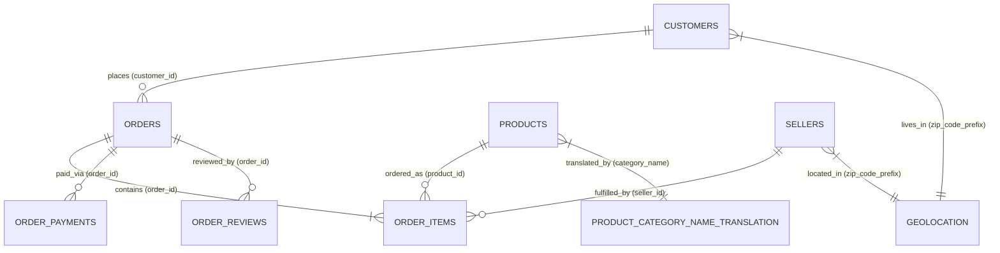
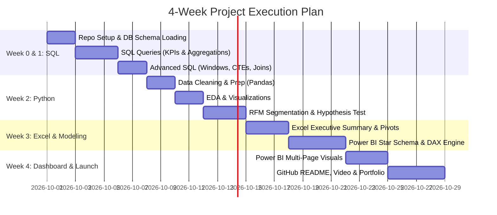

# 🚀 Complete Project Roadmap: E-Commerce Sales & Customer Analysis (Olist Dataset)
**Language:** Hinglish | **Target Timeline:** 4 Hafta (28 Din) | **Commitment:** 2-3 Ghante Roz  
**Tools Stack:** SQL (PostgreSQL/MySQL), Python (Pandas, Seaborn, Scipy), Excel, Power BI, Git & GitHub

---

## 📌 Executive Summary & Project Goal
Is project ka maqsad sirf charts banana nahi hai, balki ek real-world business analyst/data analyst ki tarah **100K+ real e-commerce transactions** ko analyze karke business problems solve karna hai:
1. **Revenue kahan se generate ho raha hai aur bottlenecks kahan hain?**
2. **Customer segmentation (RFM) ke zariye repeat retention kaise badhayen?**
3. **Logistics delay aur customer review ratings ke beech direct correlation kya hai?**
4. **Leadership ke liye decision-ready interactive Power BI dashboard kaise deploy karein?**

---

## 🗂️ Dataset Architecture (Olist 9 Tables Relationship)



---

## 🗓️ Phase-by-Phase Day-by-Day Timeline



---

## 📁 Recommended Repo Folder Structure

```text
ecommerce-sales-analysis/
│
├── README.md                           <-- Main project showcase (executive summary, charts, insights)
├── .gitignore                          <-- Ignore raw .csv files agar >100MB ho
├── data/
│   ├── raw/                            <-- Kaggle download links & notes (data dictionary)
│   └── processed/                      <-- Cleaned aggregated CSVs / RFM output
├── sql/
│   ├── 01_schema_setup.sql             <-- CREATE TABLE statements & constraints
│   ├── 02_kpi_and_trends.sql           <-- Monthly revenue, order volume, AOV
│   ├── 03_customer_and_delivery.sql    <-- Late delivery %, repeat customers, SLA
│   └── 04_advanced_analytics.sql       <-- Window functions, NTILE segments, MoM growth
├── python/
│   ├── 01_data_cleaning_eda.ipynb      <-- Missing value treatment, outlier checks, distributions
│   ├── 02_rfm_customer_segments.ipynb  <-- Recency, Frequency, Monetary scoring logic
│   └── 03_hypothesis_testing.ipynb     <-- T-test: Late delivery vs Review Score
├── excel/
│   └── olist_executive_summary.xlsx    <-- Dynamic pivot tables, KPI cards, XLOOKUP models
├── powerbi/
│   ├── olist_sales_analytics.pbix      <-- 3-page interactive report file
│   └── screenshots/                    <-- High-res dashboard images for GitHub & LinkedIn
└── docs/
    ├── insights_and_recommendations.md  <-- Business recommendations for stakeholders
    └── interview_talking_points.md     <-- Q&A for hiring managers
```

---

## 📅 HAFTA 1: Database Setup & Advanced SQL (Din 1 - Din 7)

### Din 1: Setup & Data Ingestion
- **Repo Init**: GitHub par `ecommerce-sales-analysis` repo banao aur clone karo.
- **Database Choice**: PostgreSQL ya MySQL install karo (PostgreSQL recommended for advanced window functions).
- **Import CSVs**: Sabhi 9 CSV files import karo:
  - `olist_orders_dataset.csv`
  - `olist_order_items_dataset.csv`
  - `olist_order_payments_dataset.csv`
  - `olist_order_reviews_dataset.csv`
  - `olist_products_dataset.csv`
  - `olist_customers_dataset.csv`
  - `olist_sellers_dataset.csv`
  - `olist_geolocation_dataset.csv`
  - `product_category_name_translation.csv`
- **Keys Setup**: `order_id`, `customer_id`, `product_id`, `seller_id` par Primary/Foreign Key indexing check karo.

---

### Din 2 - Din 4: Core Business SQL Queries (Part 1)
In queries ko clean SQL comments ke saath `sql/02_kpi_and_trends.sql` mein likho:

1. **Monthly Revenue & Order Volume:**
   ```sql
   SELECT 
       DATE_TRUNC('month', o.order_purchase_timestamp) AS order_month,
       COUNT(DISTINCT o.order_id) AS total_orders,
       ROUND(SUM(oi.price)::numeric, 2) AS total_revenue,
       ROUND(AVG(oi.price)::numeric, 2) AS average_order_value
   FROM orders o
   JOIN order_items oi ON o.order_id = oi.order_id
   WHERE o.order_status = 'delivered'
   GROUP BY 1
   ORDER BY 1;
   ```
2. **Top 10 Product Categories by Revenue (English translation ke sath):**
   - Translate Portuguese categories using `product_category_name_translation`.
3. **Geographic Distribution:**
   - State-wise (`customer_state`) aur city-wise order volume and gross merchandise value (GMV).
4. **Payment Method Split & Installment Behavior:**
   - Percentage share of Credit Card, Boleto, Voucher, Debit Card, aur average installments.

---

### Din 5 - Din 7: Advanced SQL (Window Functions & Joins) (Part 2)
Inhe `sql/04_advanced_analytics.sql` mein compile karo:

5. **Month-over-Month (MoM) Growth Rate (`LAG()`):**
   ```sql
   WITH monthly_sales AS (
       SELECT 
           DATE_TRUNC('month', order_purchase_timestamp) AS sale_month,
           SUM(price) AS revenue
       FROM orders o
       JOIN order_items oi ON o.order_id = oi.order_id
       WHERE o.order_status = 'delivered'
       GROUP BY 1
   )
   SELECT 
       sale_month,
       revenue,
       LAG(revenue) OVER (ORDER BY sale_month) AS prev_month_revenue,
       ROUND(((revenue - LAG(revenue) OVER (ORDER BY sale_month)) / 
              LAG(revenue) OVER (ORDER BY sale_month) * 100)::numeric, 2) AS mom_growth_pct
   FROM monthly_sales;
   ```

6. **Delivery Delay Analysis & SLA Adherence:**
   - Calculate delay days: `EXTRACT(DAY FROM (order_delivered_customer_date - order_estimated_delivery_date))`
   - Late delivery orders percentage count.

7. **Review Score vs Delivery Delay Correlation:**
   - Bucketing delay: On Time/Early, 1-3 Din Late, 4-7 Din Late, >7 Din Late. Average review score compare karo.

8. **Top 3 Sellers in Each Category (`DENSE_RANK()`):**
   - Window function partition by category order by total seller sales.

9. **Customer Spending Quartiles (`NTILE(4)`):**
   - Customers ko spending value ke hisaab se 4 tiers (Bronze, Silver, Gold, Platinum) mein classify karo.

---

## 📅 HAFTA 2: Python Data Cleaning, EDA & Statistical/ML Analysis (Din 8 - Din 14)

### Din 8 - Din 9: Data Cleaning & Hygiene (`01_data_cleaning_eda.ipynb`)
- **Datetime Parsing**: Timestamps (`order_purchase_timestamp`, `order_delivered_customer_date`, etc.) ko datetime format mein convert karo.
- **Handling Missing Values**:
  - Nulls in `order_delivered_customer_date` (cancelled vs in-transit orders).
  - Review comments text missing values.
- **Outlier Detection**:
  - Product price aur freight value par boxplots aur IQR calculation.

---

### Din 10 - Din 11: Exploratory Data Analysis (EDA)
- **Visualizations**:
  - Delivery time distribution curve (histplot with KDE).
  - Heatmap: Purchase volume by Day of Week vs Hour of Day (Peak shopping window identify karo).
  - Freight Value vs Delivery Distance (kya shipping cost customer churn kara rahi hai?).
  - Category-wise review distribution.
- **Critical Rule**: Har graph ke niche **3-bullet business insight** likho (e.g., *"Sunday evening 7-9 PM peak traffic observe hota hai, flash campaigns yahan schedule ki ja sakti hain"*).

---

### Din 12 - Din 13: RFM Customer Segmentation (`02_rfm_customer_segments.ipynb`)
Har customer ke unique identity (`customer_unique_id`) par compute karo:
1. **Recency ($R$)**: Last purchase date se kitne din hue.
2. **Frequency ($F$)**: Total kitne orders place kiye (Note: Olist mein ~97% single-time buyers hain, ye ek key insight hai!).
3. **Monetary ($M$)**: Total kitna spend kiya.

**Segment Logic:**
- **Champions**: High spend, recent order.
- **Loyal Customers**: Moderate-to-high frequency aur consistent spend.
- **At Risk**: High value par lambe time se order nahi kiya.
- **Lost / Hibernating**: Low spend aur low recency.

---

### Din 14: Statistical Hypothesis Testing (`03_hypothesis_testing.ipynb`)
- **Business Question**: *"Kya delivery delay sach mein review rating ko drastically girata hai, ya ye chance variation hai?"*
- **Hypothesis**:
  - $H_0$ (Null): Delay hone aur on-time deliver hone wale orders ke mean review score mein koi difference nahi hai.
  - $H_1$ (Alternative): Delayed orders ka mean review score significantly lower hai.
- **Test**: Two-sample independent t-test (`scipy.stats.ttest_ind`):
  ```python
  from scipy import stats
  delayed_scores = df[df['is_delayed'] == True]['review_score']
  ontime_scores = df[df['is_delayed'] == False]['review_score']
  t_stat, p_val = stats.ttest_ind(delayed_scores, ontime_scores, equal_var=False)
  print(f"P-value: {p_val:.5e}")
  # P-value < 0.05 prove karta hai ki statistically significant impact hai!
  ```

---

## 📅 HAFTA 3: Excel Model & Power BI Semantic Layer (Din 15 - Din 21)

### Din 15 - Din 17: Excel Executive Business Summary (`olist_executive_summary.xlsx`)
Kyunki business stakeholders Excel ko pasand karte hain, ek lightweight executive dashboard create karo:
1. **Summary Sheet**:
   - High-level KPIs: Total Gross Revenue, Total Orders, Average Order Value (AOV), Overall Late Delivery %.
2. **Pivot Tables & Slicers**:
   - Monthly trend with Category Slicer.
   - Top 10 States with State-level fulfillment days.
3. **Key Excel Formulas**:
   - `XLOOKUP`: Product ID se category aur seller details fetch karna.
   - `SUMIFS` & `COUNTIFS`: Specific state aur date range ke conditional totals.
   - `IF` / `SWITCH`: Delivery status flag (Late vs On-Time).
4. **Conditional Formatting**: Delayed orders ko red-amber-green (RAG) heat highlight karna.

---

### Din 18 - Din 21: Power BI Data Modeling & DAX Calculation Engine

#### 1. Data Model (Star Schema Design)
Fact aur Dimension tables ko cleanly separate karo:
- **Fact Table**: `Fact_Orders` (order_id, customer_id, dates, status, delay_days) & `Fact_Order_Items` (order_id, item_id, product_id, seller_id, price, freight)
- **Dimension Tables**: `Dim_Customers`, `Dim_Products`, `Dim_Sellers`, `Dim_Date`

> [!TIP]
> **DAX Date Table Rule:** Hamesha dedicated date table banao using `Dim_Date = CALENDARAUTO()` aur use model mein mark as Date Table karo.

#### 2. Key DAX Measures to Write:
```dax
// 1. Total Revenue
Total Revenue = SUM(Fact_Order_Items[price])

// 2. Total Freight Cost
Total Freight = SUM(Fact_Order_Items[freight_value])

// 3. Total Orders
Total Orders = DISTINCTCOUNT(Fact_Orders[order_id])

// 4. Average Order Value (AOV)
Average Order Value = DIVIDE([Total Revenue], [Total Orders], 0)

// 5. Late Delivery %
Delayed Orders Count = 
CALCULATE(
    [Total Orders],
    Fact_Orders[delay_days] > 0
)

Late Delivery Rate % = 
DIVIDE([Delayed Orders Count], [Total Orders], 0)

// 6. Average Review Score
Average Review Score = AVERAGE(Fact_Order_Reviews[review_score])

// 7. Month-over-Month Revenue Growth
Revenue LM = 
CALCULATE(
    [Total Revenue], 
    DATEADD(Dim_Date[Date], -1, MONTH)
)

MoM Revenue Growth % = 
DIVIDE([Total Revenue] - [Revenue LM], [Revenue LM], 0)
```

---

## 📅 HAFTA 4: Power BI Report Design & Portfolio Launch (Din 22 - Din 28)

### Din 22 - Din 24: Power BI 3-Page Dashboard Build

#### 📄 Page 1: Sales & Executive Overview
- **Header**: Dynamic date filters, Title, Last refresh banner.
- **Top Row**: 4 KPI Cards (`Total Revenue`, `Total Orders`, `AOV`, `Average Review Score`).
- **Visual 1 (Area/Line Chart)**: Monthly Revenue Trend + MoM growth indicator.
- **Visual 2 (Clustered Bar Chart)**: Top 10 Product Categories by Revenue.
- **Visual 3 (Donut Chart)**: Payment Type Breakdown.
- **Slicers**: Year, Product Category, Order Status.

#### 📄 Page 2: Customer & Geographic Intelligence
- **Visual 1 (Shape Map / Filled Map)**: Brazil State-wise Revenue concentration (Highlighting SP - São Paulo dominance).
- **Visual 2 (Bar Chart)**: Customer RFM Segmentation distribution (Champions vs At Risk).
- **Visual 3 (Matrix / Table)**: Top 10 customer cities by spend, repeat order rate, and freight impact.
- **Visual 4 (Scatter Plot)**: Freight Cost vs Average Delivery Time by State.

#### 📄 Page 3: Logistics & Customer Satisfaction (The Problem Solver)
- **Top Row KPI Cards**: `Average Delivery Days`, `On-Time Delivery %`, `% of 1-Star Reviews`.
- **Visual 1 (Dual-Axis Chart)**: Delivery Delay (Days) vs Review Score (Visual proof of customer churn).
- **Visual 2 (Heatmap / Matrix)**: Seller Delivery Performance vs State SLAs.
- **Visual 3 (Bar Chart)**: Top Reasons for 1-Star Ratings (Extracted from review text/tags).

---

### Din 25 - Din 26: Killer GitHub README Documentation
Tumhara `README.md` aisa hona chahiye jo 60 seconds mein hiring manager ko impress kare:
1. **Title & Badges**: SQL, Python, Power BI, Excel badges.
2. **Project Context & Business Problem**: 2-3 lines crisp context.
3. **Dataset & Architecture**: ER Diagram ya schema table summary.
4. **Key Business Insights (The Golden Nuggets)**:
   - *Revenue Concentration*: Top 3 states (SP, RJ, MG) total sales ka **~65%** contribute karti hain.
   - *Repeat Customer Crisis*: **97% customers single-time buyers hain**—retention funnel completely missing hai.
   - *Delivery vs Satisfaction cliff*: Delay hote hi review score **4.3 stars se drop hokar 1.8 stars** par aa jata hai ($p < 0.001$).
5. **Actionable Recommendations**:
   - Local fulfillment hubs in Rio & Minas Gerais to cut shipping transit times by 40%.
   - Post-purchase loyalty program to increase repeat purchase rate from 3% to 8%.
6. **Dashboard Screenshots**: High-res images of Page 1, Page 2, Page 3.
7. **How to Reproduce**: SQL script run order aur Python environment steps.

---

### Din 27: 3-Minute Loom Video & LinkedIn Post

#### Loom Video Script (2-3 Minutes):
- **0:00 - 0:30**: Problem statement aur maine kya dataset analyze kiya.
- **0:30 - 1:30**: Power BI Dashboard walk-through (Page 1 KPIs aur Page 3 Delivery bottlenecks).
- **1:30 - 2:15**: Python RFM finding aur statistical hypothesis test explanation.
- **2:15 - 3:00**: Stakeholder ke liye meri 2 major strategic recommendations.

#### LinkedIn Post Draft (Copy-Paste Ready):
> 🚀 Excited to share my latest end-to-end Data Analytics project: **E-Commerce Sales & Customer Satisfaction Analysis (100K+ Orders)**.
> 
> Using SQL, Python, Excel, and Power BI, I dug deep into the Brazilian Olist e-commerce dataset to solve a major business question: *Why does customer satisfaction dip and where is our revenue bleeding?*
> 
> 🔍 **Key Findings:**
> 1. **Logistics cliff:** Delivery delays directly crashed customer ratings from 4.3⭐ to 1.8⭐ (Statistically proven via Two-Sample T-Test, p < 0.001).
> 2. **Retention gap:** Over 97% of buyers were one-time purchasers, signaling a high CAC and missing lifecycle marketing.
> 3. **Geographic concentration:** Just 3 states drive ~65% of overall GMV, while outer states suffer from high freight rates.
> 
> 🛠️ **Tech Stack:**
> - SQL: CTEs, Window Functions (RANK, LAG), Joins
> - Python: Pandas, Seaborn, RFM Segmentation, Scipy stats
> - Power BI: Star Schema, DAX, Interactive 3-page UI
> 
> 🔗 GitHub Repo & Dashboard Preview: [Your Link Here]
> 
> #DataAnalytics #SQL #PowerBI #Python #DataScience #PortfolioProject

---

### Din 28: Resume Bullets & Interview Preparation

#### Resume Bullet Points (Tailored for ATS):
- *Analyzed 100,000+ Brazilian e-commerce transactions across 9 relational tables using PostgreSQL and Python (Pandas), identifying key drivers of sales performance and logistics bottlenecks.*
- *Built an RFM customer segmentation model in Python, uncovering that 97% of transactions were single purchases and creating targeted strategies to boost customer lifetime value (CLV).*
- *Conducted statistical hypothesis testing (Two-sample T-test, p < 0.001) demonstrating that logistics delays caused a 58% decline in customer satisfaction scores.*
- *Architected a 3-page interactive Power BI dashboard with 12+ custom DAX measures and Star Schema data modeling, tracking GMV, SLA adherence, and regional logistics efficiency.*

#### Top 3 Interview Questions You Will Ace:
1. **"Is project mein data cleaning ka sabse challenging part kya tha?"**
   - *Answer*: Olist dataset mein `customer_id` har order ke liye alag hota hai, jabki `customer_unique_id` real customer ko identify karta hai. Repeat analysis ke liye unique ID ko map karna zaroori tha. Sath hi timestamp fields mein delivery nulls aur Portuguese category translations ko handle karna pada.
2. **"Power BI mein star schema kyun banaya, direct flat table kyun nahi use ki?"**
   - *Answer*: Flat denormalized table 100k+ rows par memory-heavy hoti hai aur duplicate rows ki wajah se aggregations (like DISTINCTCOUNT) slow ho jaate hain. Star schema se DAX engine fast perform karta hai aur filter propagation natural rehta hai.
3. **"Agar management tumhare recommendations par sirf ek action le sakti hai, toh kya hoga?"**
   - *Answer*: Regional logistics warehouses (fulfillment centers) establish karna high-density regions mein. Late deliveries par review score 1.8 tak girta hai jo organic acquisition aur repeat sales ko sabse zyada damage karta hai.

---

## 🎯 Verification Checklist Before Calling it "Done"
- [ ] Saari SQL queries commented hain aur error-free execute hoti hain.
- [ ] Python notebook mein har chart ke sath actionable textual insights hain.
- [ ] Power BI dashboard mein visual alignment, clear color coding, aur working slicers hain.
- [ ] GitHub README mein broken image links nahi hain aur code structure clear hai.
- [ ] Resume aur LinkedIn par link live hai.
